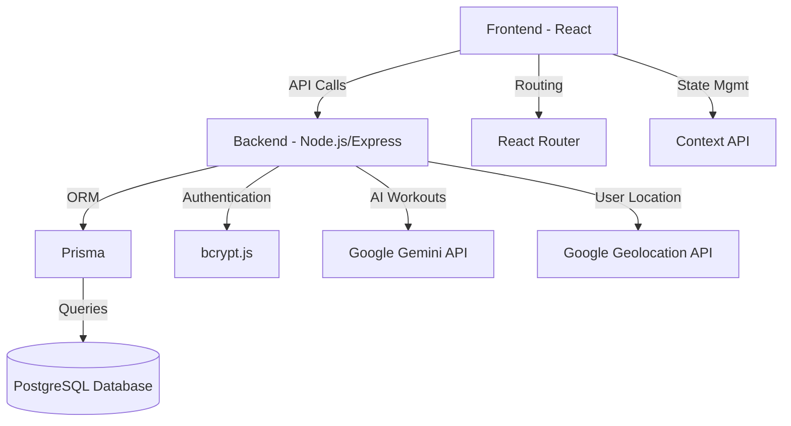
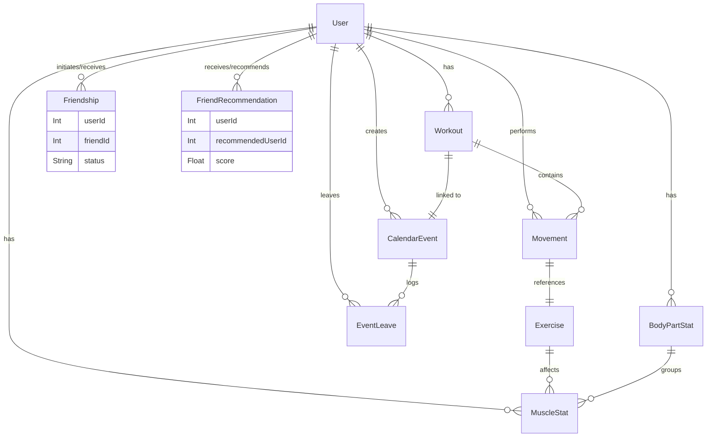
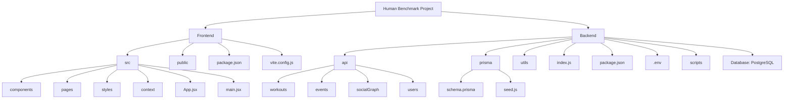

# Human Benchmark

A social fitness platform to track workouts, connect with friends, and level up your training.

---

## 📌 Overview
**Human Benchmark** is a full-stack fitness tracking platform that combines social networking with workout analytics.
Users can:
- Log workouts
- Compare progress with friends
- Participate in leaderboards
- Receive personalized workout recommendations powered by AI

---

## 🚀 Features
- **Connect with Friends**: Social graph with friend requests and friend recommendations.
- **Track Workouts**: Log movements, sets, reps, and weights.
- **Workout Stats**: Gain XP, level up, and track stats.
- **Build Workouts**: Create custom workout plans.
- **AI Assistant**: Generate personalized workout plans using Google Gemini AI.
- **Leaderboard**: Compare stats with friends.
- **Calendar**: Schedule events, invite friends, and manage workout sessions.

---

## 🛠 Tech Stack



---

## 🗄 Database Schema



---


## 📂 Project Structure




---

## 📦 Dependencies

### Frontend
```json
"axios": "^1.10.0",
"bcryptjs": "^3.0.2",
"cors": "^2.8.5",
"react": "^19.1.0",
"react-dom": "^19.1.0",
"react-router": "^7.6.2"
```

### Backend
```json
"@google/genai": "^1.11.0",
"@google/generative-ai": "^0.24.1",
"@prisma/client": "^6.10.1",
"axios": "^1.10.0",
"bcryptjs": "^3.0.2",
"cors": "^2.8.5",
"express": "^5.1.0",
"express-session": "^1.18.1",
"helmet": "^8.1.0",
"prisma": "^6.10.1"
```

---

## 🖥 Scripts

### Frontend
```json
"dev": "vite",
"build": "vite build",
"lint": "eslint .",
"preview": "vite preview"
```

### Backend
```json
"dev": "node --env-file=.env --watch index.js",
"start": "node index.js",
"build": "npm install && npm run db:init",
"db:migrate": "prisma migrate dev",
"db:reset": "prisma migrate reset --force",
"db:seed": "node prisma/seed.js",
"db:init": "npm run db:reset && npm run db:migrate && npm run db:seed",
"psql": "psql shelterdb -U app_user"
```

---

## 🚀 Getting Started

### 1. Clone the Repository
```bash
git clone https://github.com/your-username/human-benchmark.git
```

### 2. Install Dependencies
```bash
cd backend && npm install
cd ../frontend && npm install
```

### 3. Setup Environment Variables
Create a `.env` file in the backend directory with your database connection and API keys.

### 4. Run the Application
```bash
# Start backend
npm run dev

# Start frontend
npm run dev
```

---

## 🤝 Contributing
Contributions are welcome!
1. Fork the repository
2. Create a feature branch (`git checkout -b feature-branch`)
3. Commit your changes (`git commit -m 'Add new feature'`)
4. Push to the branch (`git push origin feature-branch`)
5. Open a Pull Request

---

## 📜 License
This project is licensed under the [MIT License](LICENSE).

---

© 2025 Human Benchmark. All rights reserved.
